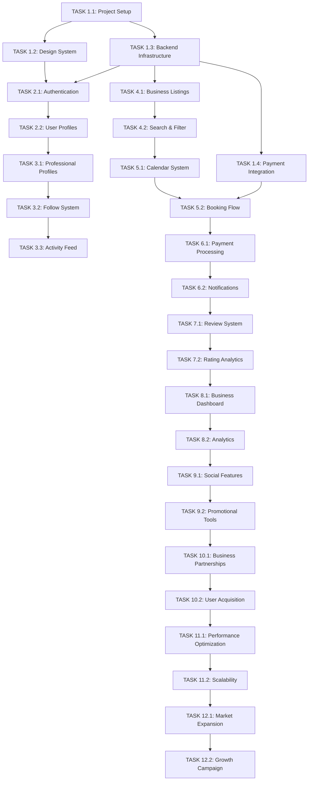

# 🚀 Ayna - Comprehensive Task Management System
# Fresha-Inspired Beauty & Wellness Booking Platform

## 📊 PROJECT OVERVIEW
**Platform**: Compose Multiplatform (Android, iOS, Desktop)  
**Target Market**: Turkish Beauty & Wellness Industry  
**Core Differentiator**: Expert Following System  
**Timeline**: 12 Months to MVP + Scale  
**Team Size**: 8-12 people  

---

## 🎯 STRATEGIC ROADMAP (90-Day Action Plan)

### 📌 PHASE 1: Foundation & MVP (Weeks 1-12)

#### Week 1-2: Project Setup & Architecture
**Priority**: P0 (Critical) | **Effort**: 80 hours | **Team**: Tech Lead, Backend Dev, Frontend Dev

- [ ] **TASK 1.1**: Initialize Compose Multiplatform Project Structure
  - **Assignee**: Tech Lead
  - **Effort**: 16 hours
  - **Acceptance Criteria**: 
    - Project builds successfully on all platforms
    - Basic navigation structure implemented
    - CI/CD pipeline configured
  - **Dependencies**: None
  - **Resources**: [Compose Multiplatform Setup Guide](https://github.com/JetBrains/compose-multiplatform)

- [ ] **TASK 1.2**: Design System Implementation
  - **Assignee**: UI/UX Designer, Frontend Dev
  - **Effort**: 24 hours
  - **Acceptance Criteria**:
    - Color palette implemented (#0D1619, #037AFF, #FFFFFF)
    - Typography system (Roboto/Inter)
    - Component library with 20+ reusable components
  - **Dependencies**: TASK 1.1
  - **Resources**: [Material Design 3 Guidelines](https://m3.material.io/)

- [ ] **TASK 1.3**: Backend Infrastructure Setup
  - **Assignee**: Backend Dev, DevOps
  - **Effort**: 20 hours
  - **Acceptance Criteria**:
    - Firebase/Supabase project configured
    - Authentication system ready
    - Database schema designed
    - API endpoints structure defined
  - **Dependencies**: None
  - **Resources**: [Firebase Setup Guide](https://firebase.google.com/docs)

- [ ] **TASK 1.4**: Payment Integration Foundation
  - **Assignee**: Backend Dev, Payment Specialist
  - **Effort**: 20 hours
  - **Acceptance Criteria**:
    - Iyzico integration for Turkish market
    - Stripe integration for international
    - Test payment flows working
  - **Dependencies**: TASK 1.3
  - **Resources**: [Iyzico API Documentation](https://www.iyzico.com/en/api)

#### Week 3-4: Core Authentication & User Management
**Priority**: P0 | **Effort**: 60 hours | **Team**: Frontend Dev, Backend Dev, QA

- [ ] **TASK 2.1**: User Authentication System
  - **Assignee**: Frontend Dev, Backend Dev
  - **Effort**: 32 hours
  - **Acceptance Criteria**:
    - Email/phone registration and login
    - Social media login (Google, Apple, Facebook)
    - Password reset functionality
    - Email verification system
  - **Dependencies**: TASK 1.1, TASK 1.3
  - **Resources**: [Firebase Auth Documentation](https://firebase.google.com/docs/auth)

- [ ] **TASK 2.2**: User Profile Management
  - **Assignee**: Frontend Dev, Backend Dev
  - **Effort**: 28 hours
  - **Acceptance Criteria**:
    - User profile creation and editing
    - Profile picture upload
    - Preference settings (notifications, language)
    - Location permission handling
  - **Dependencies**: TASK 2.1
  - **Resources**: [Compose Image Handling](https://developer.android.com/jetpack/compose/graphics/images)

#### Week 5-6: Expert Following System (Core Differentiator)
**Priority**: P0 | **Effort**: 80 hours | **Team**: Frontend Dev, Backend Dev, UI/UX Designer

- [ ] **TASK 3.1**: Professional Profile System
  - **Assignee**: Frontend Dev, Backend Dev
  - **Effort**: 40 hours
  - **Acceptance Criteria**:
    - Professional profile creation
    - Portfolio upload (images, certifications)
    - Specialization tags
    - Work samples gallery
  - **Dependencies**: TASK 2.1
  - **Resources**: [Compose Gallery Implementation](https://developer.android.com/jetpack/compose/lists)

- [ ] **TASK 3.2**: Follow/Unfollow Functionality
  - **Assignee**: Backend Dev, Frontend Dev
  - **Effort**: 24 hours
  - **Acceptance Criteria**:
    - Follow/unfollow professionals
    - Followers/following lists
    - Real-time follow count updates
  - **Dependencies**: TASK 3.1
  - **Resources**: [Firebase Realtime Database](https://firebase.google.com/docs/database)

- [ ] **TASK 3.3**: Activity Feed Implementation
  - **Assignee**: Frontend Dev, Backend Dev
  - **Effort**: 16 hours
  - **Acceptance Criteria**:
    - Activity feed showing followed professionals
    - New work posts notifications
    - Availability updates
  - **Dependencies**: TASK 3.2
  - **Resources**: [Compose LazyColumn with Pagination](https://developer.android.com/jetpack/compose/lists)

#### Week 7-8: Business Discovery & Search
**Priority**: P1 | **Effort**: 70 hours | **Team**: Frontend Dev, Backend Dev, UI/UX Designer

- [ ] **TASK 4.1**: Business Listing System
  - **Assignee**: Backend Dev, Frontend Dev
  - **Effort**: 32 hours
  - **Acceptance Criteria**:
    - Business profile creation
    - Service catalog management
    - Pricing and duration setup
    - Business hours configuration
  - **Dependencies**: TASK 1.3
  - **Resources**: [Firebase Firestore CRUD Operations](https://firebase.google.com/docs/firestore)

- [ ] **TASK 4.2**: Advanced Search & Filtering
  - **Assignee**: Frontend Dev, Backend Dev
  - **Effort**: 38 hours
  - **Acceptance Criteria**:
    - Search by service type, location, price
    - Filter by rating, distance, availability
    - Map view integration
    - Search results pagination
  - **Dependencies**: TASK 4.1
  - **Resources**: [Google Maps API for Compose](https://developers.google.com/maps/documentation/android-sdk)

#### Week 9-10: Booking System Core
**Priority**: P0 | **Effort**: 90 hours | **Team**: Frontend Dev, Backend Dev, QA

- [ ] **TASK 5.1**: Calendar & Availability Management
  - **Assignee**: Backend Dev, Frontend Dev
  - **Effort**: 40 hours
  - **Acceptance Criteria**:
    - Real-time availability calendar
    - Multi-staff scheduling
    - Appointment slot management
    - Conflict detection
  - **Dependencies**: TASK 4.1
  - **Resources**: [Compose Calendar Implementation](https://developer.android.com/jetpack/compose/ui)

- [ ] **TASK 5.2**: Booking Flow Implementation
  - **Assignee**: Frontend Dev, Backend Dev
  - **Effort**: 50 hours
  - **Acceptance Criteria**:
    - Service selection interface
    - Date/time picker
    - Booking confirmation
    - Payment integration
  - **Dependencies**: TASK 5.1, TASK 1.4
  - **Resources**: [Compose Date/Time Pickers](https://developer.android.com/jetpack/compose/ui)

#### Week 11-12: Payment & Notification System
**Priority**: P0 | **Effort**: 60 hours | **Team**: Backend Dev, Frontend Dev, DevOps

- [ ] **TASK 6.1**: Payment Processing Integration
  - **Assignee**: Backend Dev, Payment Specialist
  - **Effort**: 32 hours
  - **Acceptance Criteria**:
    - Iyzico payment flow
    - Payment confirmation
    - Refund processing
    - Transaction history
  - **Dependencies**: TASK 5.2
  - **Resources**: [Iyzico Payment API](https://www.iyzico.com/en/api)

- [ ] **TASK 6.2**: Push Notification System
  - **Assignee**: Backend Dev, Frontend Dev
  - **Effort**: 28 hours
  - **Acceptance Criteria**:
    - FCM integration for Android
    - APNs integration for iOS
    - Booking reminders (24h, 2h, 30min)
    - Custom notification types
  - **Dependencies**: TASK 6.1
  - **Resources**: [Firebase Cloud Messaging](https://firebase.google.com/docs/cloud-messaging)

---

## 📱 MVP DEVELOPMENT TASKS

### 📌 PHASE 2: Enhanced Features (Weeks 13-24)

#### Week 13-16: Review & Rating System
**Priority**: P1 | **Effort**: 80 hours | **Team**: Frontend Dev, Backend Dev, QA

- [ ] **TASK 7.1**: Review System Implementation
  - **Assignee**: Frontend Dev, Backend Dev
  - **Effort**: 40 hours
  - **Acceptance Criteria**:
    - Post-appointment review flow
    - Star rating system
    - Text review with character limits
    - Photo review upload
  - **Dependencies**: TASK 6.1
  - **Resources**: [Compose Rating Component](https://developer.android.com/jetpack/compose/ui)

- [ ] **TASK 7.2**: Rating Analytics & Display
  - **Assignee**: Backend Dev, Frontend Dev
  - **Effort**: 40 hours
  - **Acceptance Criteria**:
    - Average rating calculation
    - Review moderation system
    - Rating display on business profiles
    - Review filtering and sorting
  - **Dependencies**: TASK 7.1
  - **Resources**: [Firebase Analytics](https://firebase.google.com/docs/analytics)

#### Week 17-20: Business Dashboard & Analytics
**Priority**: P1 | **Effort**: 100 hours | **Team**: Frontend Dev, Backend Dev, Data Analyst

- [ ] **TASK 8.1**: Business Dashboard UI
  - **Assignee**: Frontend Dev, UI/UX Designer
  - **Effort**: 50 hours
  - **Acceptance Criteria**:
    - Revenue overview dashboard
    - Appointment calendar view
    - Customer management interface
    - Staff management tools
  - **Dependencies**: TASK 7.2
  - **Resources**: [Compose Dashboard Components](https://developer.android.com/jetpack/compose/ui)

- [ ] **TASK 8.2**: Analytics & Reporting
  - **Assignee**: Backend Dev, Data Analyst
  - **Effort**: 50 hours
  - **Acceptance Criteria**:
    - Revenue analytics
    - Customer acquisition metrics
    - Popular services analysis
    - Export functionality
  - **Dependencies**: TASK 8.1
  - **Resources**: [Firebase Analytics Dashboard](https://firebase.google.com/docs/analytics)

#### Week 21-24: Social Features & Marketing Tools
**Priority**: P2 | **Effort**: 90 hours | **Team**: Frontend Dev, Backend Dev, Marketing

- [ ] **TASK 9.1**: Social Sharing Integration
  - **Assignee**: Frontend Dev, Backend Dev
  - **Effort**: 40 hours
  - **Acceptance Criteria**:
    - Instagram/TikTok integration
    - Social media sharing
    - Before/after photo sharing
    - Hashtag generation
  - **Dependencies**: TASK 8.2
  - **Resources**: [Social Media APIs](https://developers.facebook.com/docs/instagram-basic-display-api)

- [ ] **TASK 9.2**: Promotional Tools
  - **Assignee**: Backend Dev, Frontend Dev
  - **Effort**: 50 hours
  - **Acceptance Criteria**:
    - Discount code system
    - Flash sale creation
    - Loyalty program setup
    - Referral system
  - **Dependencies**: TASK 9.1
  - **Resources**: [Firebase Dynamic Links](https://firebase.google.com/docs/dynamic-links)

---

## 🎯 MARKET ENTRY EXECUTION TASKS

### 📌 PHASE 3: Market Launch (Weeks 25-36)

#### Week 25-28: Istanbul Kadıköy Pilot Launch
**Priority**: P0 | **Effort**: 120 hours | **Team**: Business Development, Marketing, Support

- [ ] **TASK 10.1**: Business Partnership Development
  - **Assignee**: Business Development Manager
  - **Effort**: 60 hours
  - **Acceptance Criteria**:
    - 50+ businesses onboarded in Kadıköy
    - Partnership agreements signed
    - Training sessions completed
    - Support system established
  - **Dependencies**: TASK 9.2
  - **Resources**: [Business Partnership Templates](https://docs.google.com/spreadsheets)

- [ ] **TASK 10.2**: User Acquisition Campaign
  - **Assignee**: Marketing Manager, Growth Hacker
  - **Effort**: 60 hours
  - **Acceptance Criteria**:
    - 1,000+ registered users
    - TikTok/Instagram campaigns launched
    - Influencer partnerships secured
    - Referral program activated
  - **Dependencies**: TASK 10.1
  - **Resources**: [Social Media Marketing Guide](https://buffer.com/library/social-media-strategy)

#### Week 29-32: Performance Optimization & Scaling
**Priority**: P1 | **Effort**: 100 hours | **Team**: Backend Dev, DevOps, QA

- [ ] **TASK 11.1**: Performance Optimization
  - **Assignee**: Backend Dev, DevOps
  - **Effort**: 50 hours
  - **Acceptance Criteria**:
    - Database query optimization
    - Image loading optimization
    - API response time < 200ms
    - 99.9% uptime achieved
  - **Dependencies**: TASK 10.2
  - **Resources**: [Firebase Performance Monitoring](https://firebase.google.com/docs/perf-mon)

- [ ] **TASK 11.2**: Scalability Preparation
  - **Assignee**: DevOps, Backend Dev
  - **Effort**: 50 hours
  - **Acceptance Criteria**:
    - Auto-scaling configuration
    - Load balancing setup
    - CDN integration
    - Database sharding preparation
  - **Dependencies**: TASK 11.1
  - **Resources**: [Google Cloud Auto Scaling](https://cloud.google.com/compute/docs/autoscaler)

#### Week 33-36: Expansion to Other Districts
**Priority**: P1 | **Effort**: 150 hours | **Team**: Business Development, Marketing, Support

- [ ] **TASK 12.1**: Beşiktaş & Şişli Expansion
  - **Assignee**: Business Development Manager
  - **Effort**: 80 hours
  - **Acceptance Criteria**:
    - 100+ businesses in new districts
    - Local marketing campaigns
    - Community partnerships
    - Support team expansion
  - **Dependencies**: TASK 11.2
  - **Resources**: [Local Business Directory](https://www.yellowpages.com.tr)

- [ ] **TASK 12.2**: User Growth Campaign
  - **Assignee**: Marketing Manager, Growth Hacker
  - **Effort**: 70 hours
  - **Acceptance Criteria**:
    - 5,000+ total users
    - Viral growth mechanisms
    - User retention optimization
    - Community building
  - **Dependencies**: TASK 12.1
  - **Resources**: [Growth Hacking Strategies](https://growthhackers.com)

---

## 🛡️ RISK MITIGATION TASKS

### 📌 COMPETITIVE ANALYSIS & MONITORING
**Priority**: P1 | **Ongoing** | **Team**: Product Manager, Marketing

- [ ] **TASK 13.1**: Competitive Intelligence System
  - **Assignee**: Product Manager
  - **Effort**: 20 hours/month
  - **Acceptance Criteria**:
    - Weekly competitor analysis reports
    - Feature comparison matrix
    - Pricing strategy monitoring
    - Market share tracking
  - **Dependencies**: None
  - **Resources**: [Competitive Analysis Tools](https://www.similarweb.com)

### 📌 LEGAL COMPLIANCE & REGULATIONS
**Priority**: P0 | **Effort**: 60 hours | **Team**: Legal Counsel, Backend Dev

- [ ] **TASK 14.1**: Turkish Market Compliance
  - **Assignee**: Legal Counsel
  - **Effort**: 40 hours
  - **Acceptance Criteria**:
    - KVKK compliance implementation
    - Turkish business law compliance
    - Tax regulation adherence
    - Consumer protection compliance
  - **Dependencies**: TASK 1.3
  - **Resources**: [Turkish Data Protection Law](https://www.kvkk.gov.tr)

- [ ] **TASK 14.2**: Security Audit & Implementation
  - **Assignee**: Backend Dev, Security Specialist
  - **Effort**: 20 hours
  - **Acceptance Criteria**:
    - Security audit completed
    - Penetration testing
    - Data encryption implementation
    - Security monitoring setup
  - **Dependencies**: TASK 14.1
  - **Resources**: [OWASP Security Guidelines](https://owasp.org)

### 📌 QUALITY ASSURANCE & TESTING
**Priority**: P0 | **Ongoing** | **Team**: QA Engineer, Frontend Dev, Backend Dev

- [ ] **TASK 15.1**: Comprehensive Testing Strategy
  - **Assignee**: QA Engineer
  - **Effort**: 40 hours
  - **Acceptance Criteria**:
    - Unit test coverage > 80%
    - Integration test suite
    - UI automation tests
    - Performance test scenarios
  - **Dependencies**: TASK 1.1
  - **Resources**: [Compose Testing Guide](https://developer.android.com/jetpack/compose/testing)

---

## 📈 SUCCESS METRICS & KPIs

### 🎯 CUSTOMER METRICS
- **Monthly Active Users (MAU)**: Target 25,000 by month 12
- **Booking Conversion Rate**: Target 15-20% from search to booking
- **Customer Retention Rate**: Target 70% monthly retention
- **Average Session Duration**: Target 4-6 minutes

### 🏢 BUSINESS METRICS
- **Business Acquisition Rate**: Target 1,000 businesses by month 12
- **Average Revenue Per Business**: Target ₺2,000 monthly GMV
- **Platform Commission Revenue**: Target ₺500,000 monthly by month 12
- **Payment Processing Volume**: Target ₺10M+ monthly transactions

### ⚙️ OPERATIONAL METRICS
- **App Store Ratings**: Maintain 4.5+ stars
- **Customer Support Response Time**: Under 2 hours
- **Platform Uptime**: 99.9% availability
- **Transaction Success Rate**: 99.5% payment completion

---

## 🔄 DEPENDENCY MAP

---

## 📋 WEEKLY SPRINT TEMPLATE

### Sprint Planning (Every Monday)
- [ ] Review previous sprint completion
- [ ] Prioritize tasks for current sprint
- [ ] Assign resources and estimate effort
- [ ] Identify blockers and dependencies

### Daily Standup (Every Day)
- [ ] What was completed yesterday?
- [ ] What will be worked on today?
- [ ] Any blockers or issues?
- [ ] Help needed from team members?

### Sprint Review (Every Friday)
- [ ] Demo completed features
- [ ] Gather stakeholder feedback
- [ ] Update task status
- [ ] Plan next sprint

### Sprint Retrospective (Every Friday)
- [ ] What went well?
- [ ] What could be improved?
- [ ] Action items for next sprint
- [ ] Team morale check

---

## 🎯 IMMEDIATE NEXT STEPS

### This Week (Week 1)
1. **TASK 1.1**: Initialize Compose Multiplatform Project Structure
2. **TASK 1.3**: Backend Infrastructure Setup
3. **Team Onboarding**: Assign roles and responsibilities
4. **Development Environment Setup**: All team members

### Next Week (Week 2)
1. **TASK 1.2**: Design System Implementation
2. **TASK 1.4**: Payment Integration Foundation
3. **User Research**: Conduct interviews with target users
4. **Competitive Analysis**: Deep dive into Fresha, Booksy, StyleSeat

### Week 3
1. **TASK 2.1**: User Authentication System
2. **TASK 2.2**: User Profile Management
3. **Business Development**: Start approaching Kadıköy businesses
4. **Marketing Strategy**: Develop social media presence

---

**Note**: This task management system will be updated weekly based on progress, feedback, and market conditions. Each task includes acceptance criteria, dependencies, and resource links to ensure successful completion. 